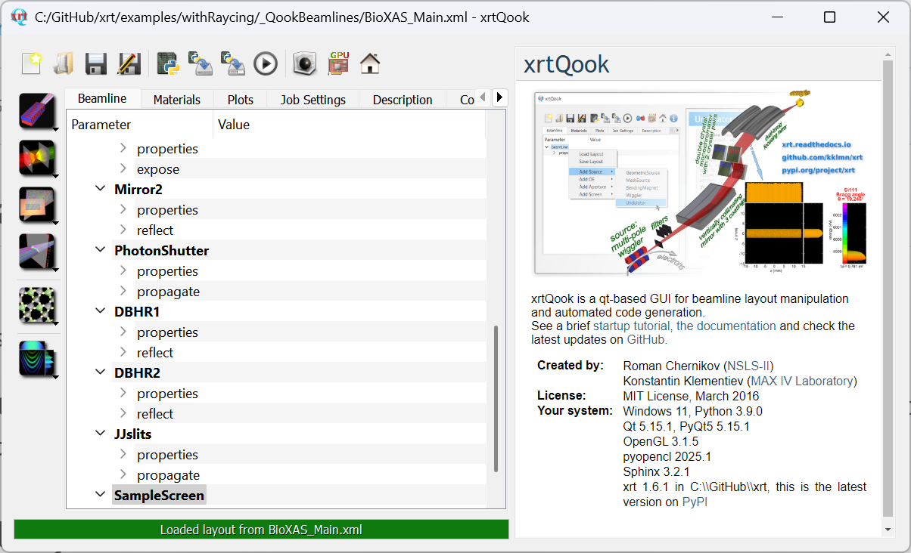
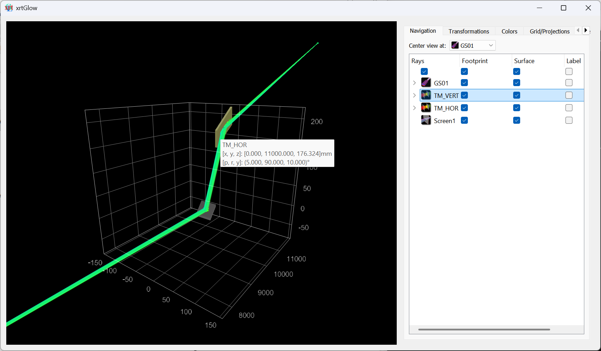
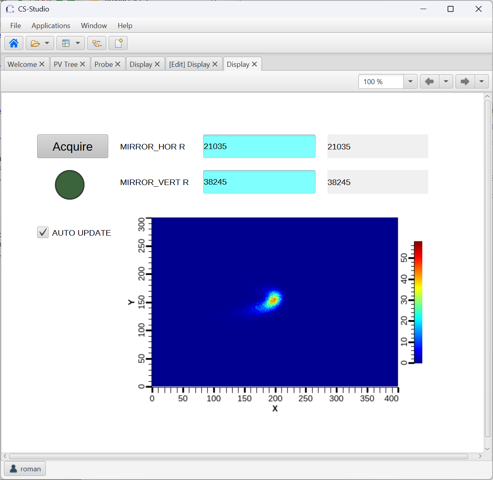

# Using bluesky to control and optimize a virtual beamline

## xrt as a beamline simulation package
[xrt](https://xrt.readthedocs.io/) is an open-source python library for synchrotron beamline simulation. It provides a broad
collection of pre-defined optical elements (shapes) and materials, as well as a set of GUI tools to
prepare and interact with the beamline model.



Recently we've added EPICS support to control beamline model (WARNING! Development code, release planned in June 2025).
This enables simple integration with ophyd and bluesky.

## Proposed tutorial directory structure
```tutorial-top-level
    \blop-xrt-examples
        trace_KB_glow.py
        xrt_screen.bob
    \py311 (conda env)
    \xrt-new_glow
    \ipython_sim
        \profile_collection_xrt
            \startup
                00-startup.py
                10-motors.py
                20-detectors.py
                90-blop.py
```


## xrt installation
Let's start with a fresh conda evironment

```bash
conda create -p path python=3.11
```

Clone [xrt/new_glow](https://github.com/kklmn/xrt/tree/new_glow) and pip install from source.

```bash
pip install -e .[pyqt5]
```

and pythonSoftIOC

```bash
pip install softioc
```

Clone the bluesky integration [examples](https://github.com/yxrmz/blop-xrt-examples/tree/main)

We'll try running a simple model with two meridionally bent mirrors. Navigate to the examples location and run

```bash
python trace_KB_glow.py
```



Now let's enable EPICS support.
Uncomment the 'epicsPrefix' in the beamLine.glow() call.

```python
    beamLine.glow(v2=True, epicsPrefix='TST')
```

If we have Phoebus installed, we can already control some parameters of the mirrors and also control the simulation workflow.
Let's open the xrt_screen.bob in Phoebus.



## Control the model with ophyd and bluesky

First let's install bluesky

```bash
pip install bluesky ipython databroker ophyd h5py pyepics
```

and use IPython [startup files](https://github.com/yxrmz/profile_collection_xrt).

Let's see how xrt objects are wrapped in ophyd classes (10-motors.py, 20-detectors.py)

Start a bluesky session with

```bash
ipython --ipython-dir=ipython_sim --profile=collection_xrt --matplotlib=qt
```
 
We can change virtual mirror positions and scan virtual motors! Let's disable auto-update, as the scan will controll the trigger.

```ipython
RE(bp.scan([xrt_screen], mirror_hor.R, 15000, 25000, 100))
```

Or even a grid scan:

```ipython
RE(bp.grid_scan([xrt_screen], mirror_hor.R, 19000, 22000, 10, mirror_vert.R, 36000, 39000, 10))
```

This takes some time though, let's get to more efficient optimization.

## blop for virtual beamline optimization

```bash
pip install blop
```

Uncomment the code in 90-blop.py

See how blop agent is defined: degrees of freedom, objectives, digestion.

Restart IPython and run optimization routine in bluesky console.

```ipython
run_mirror_optimization()
```

When completed, blop will show some stats:


Try your own beamline model!
